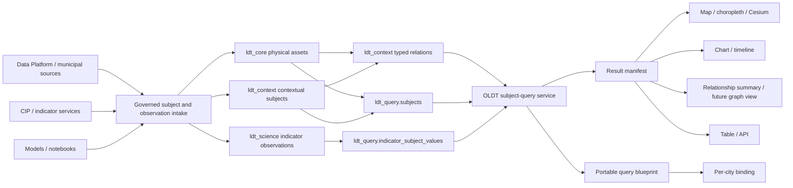

# Context Subjects And Portable Semantic Queries

Updated: 2026-07-12

## Decision

OLDT now separates two kinds of canonical subjects:

1. **Physical city assets** remain in `ldt_core.city_entities`: buildings,
   roads, facilities, land-use geometry, green-blue systems, mobility assets,
   sensors, networks, and future infrastructure.
2. **Contextual subjects** live in `ldt_context.context_subjects`: statistical
   areas, population cohorts, service zones, organizations, elections, policy
   documents, and flow accounts.

This is additive. It does not replace the physical twin, duplicate its
geometry, or make Data Modeller, CIP, Data Platform, or another EU LDT tool a
mandatory dependency. Standalone OLDT continues to work with only the physical
inventory. Context subjects become available when a city loads authoritative
aggregate data or an integration returns it.

The practical rule is:

> Store a measurement on the subject it actually describes. Do not attach an
> unemployment rate, election turnout, or life expectancy to a building just
> because buildings have geometry.

## Why This Exists

The original TwinQL path is intentionally object-centric. It answers questions
such as:

- buildings above 15 meters;
- roads of a given class;
- facilities inside a radius;
- model outputs attached to physical entities.

That is correct for the physical twin but incomplete for city intelligence.
Many indicators describe a city, statistical area, population cohort, service
zone, institution, election, policy, or flow. Those subjects can be spatial,
non-spatial, or related to physical assets.

The new subject-query path supports those honest grains and lets the result
choose its renderer instead of forcing every answer onto a map.

## Architecture



No graph database is required for this phase. PostgreSQL/PostGIS stores the
subjects, geometry, observations, relations, query blueprints, bindings, and
runs. A graph store can be introduced later only if measured workloads require
deep multi-hop traversal.

## Data Model

### Physical Assets

Source of truth:

```text
ldt_core.city_entities
ldt_core.building_entities
ldt_core.road_entities
ldt_core.facility_entities
...
```

Physical assets keep their existing stable identity, authority state,
provenance, geometry, typed detail tables, and viewer transports.

### Contextual Subjects

Table:

```text
ldt_context.context_subjects
```

Important fields:

- `subject_key`: stable city-local identifier;
- `subject_type`: `statistical-area`, `population-cohort`, `service-zone`,
  `organization`, `election`, `policy-document`, `flow-account`, or another
  governed type;
- `domain_type`: demography, health, mobility, energy, governance, etc.;
- `authority_status`;
- `privacy_class`: `public`, `aggregate`, `restricted`, or `personal`;
- optional geometry;
- validity interval;
- attributes and provenance.

A context subject is not a fake map feature. Geometry is optional. A cohort,
organization, or policy can be queried without pretending it occupies one
building.

### Typed Relations

Table:

```text
ldt_context.subject_relations
```

Each endpoint can be either a context subject or a physical entity. Examples:

- statistical area `contains-asset` building;
- service zone `serves` facility;
- cohort `resides-in` statistical area;
- organization `operates` infrastructure;
- indicator policy `applies-to` administrative area.

The schema enforces exactly one endpoint kind on each side and keeps validity,
authority, and properties.

### Indicator Observations

The existing `ldt_science.indicator_observations` table now supports:

- `geography_entity_id` for physical assets;
- `context_subject_id` for contextual subjects;
- neither for a city-level aggregate;
- `value_kind`: numeric, boolean, ordinal, categorical, or JSON;
- numeric, text, and boolean values;
- numerator and denominator;
- period and scenario;
- validation and authority state;
- method, uncertainty, provenance, and metadata.

An observation cannot point to both a physical entity and a context subject.

### Read-Only Query Views

```text
ldt_query.subjects
ldt_query.indicator_subject_values
```

`ldt_query.subjects` exposes a unified read surface while preserving storage
separation. It contains physical, context, and city subjects. It does not copy
physical rows into `ldt_context`.

`ldt_query.indicator_subject_values` resolves each observation to its honest
grain and carries the indicator definition, value type, period, numerator,
denominator, validation, authority, source, and optional geometry.

## Query Contract

Endpoint:

```text
POST /api/live/current/subject-query
POST /api/live/:cityId/subject-query
```

Example:

```json
{
  "subject": {
    "kinds": ["context"],
    "types": ["statistical-area"]
  },
  "indicator": {
    "key": "u4ssc.sc-sh-si-1c",
    "operator": "gte",
    "valueKind": "numeric",
    "value": 7,
    "validationStatuses": ["validated"],
    "authorityStatuses": ["official"]
  },
  "period": {
    "from": "2026-01-01T00:00:00Z",
    "to": "2026-12-31T23:59:59Z"
  },
  "render": {
    "mode": "auto",
    "maxFeatures": 500
  }
}
```

Relation filter:

```json
{
  "subject": {
    "kinds": ["context"],
    "types": ["service-zone"]
  },
  "relation": {
    "type": "serves",
    "direction": "outgoing",
    "targetKinds": ["physical"],
    "targetTypes": ["facility"],
    "minimumCount": 3
  },
  "render": { "mode": "map" }
}
```

Safety rules:

- all filters compile to parameterized SQL;
- subject kinds, operators, value kinds, directions, limits, and render modes
  are allowlisted;
- live queries expose only `public` and `aggregate` subjects;
- `restricted` and `personal` subjects are excluded even if a request asks for
  them;
- indicator queries default to validated observations and approved authority
  states;
- one current observation per subject is selected for the requested indicator,
  period, and scenario;
- limits are capped at 5,000 rows in this first direct-result path.

## Result Manifest

Every execution returns an `oldt-semantic-result-manifest` with:

- result grain;
- measures and dimensions;
- geometry-family counts;
- recommended renderers;
- selected renderer and transport;
- privacy posture;
- portability dependencies;
- result count and truncation state.

Renderer selection:

| Result | Default renderer | Transport |
| --- | --- | --- |
| Polygon subjects plus a measure | Choropleth | GeoJSON |
| Point/line subjects | Map | GeoJSON |
| Non-spatial measure | Chart | Table |
| Non-spatial relation result | Network intent | Table |
| Mixed or explicitly tabular result | Table | Table |

The analytical map, City 3D, and Civic XR still use their existing TwinQL
transport rules for physical-object queries. Subject-query GeoJSON is a bounded
context overlay, not a replacement for MVT, 3D Tiles, selection references, or
XR scene manifests.

The current UI renders geometric subject results through the existing viewer
message contract and shows a compact chart/table preview in the same `Question`
panel for non-spatial results. A dedicated full-screen contextual analysis
workspace can be added later without changing the query contract.

## Portable Questions

Tables:

```text
ldt_analysis.subject_query_blueprints
ldt_analysis.subject_query_bindings
ldt_analysis.subject_query_runs
```

A blueprint stores the question, not a copied result set. It includes:

- stable key and version;
- query contract;
- renderer recipe;
- standard references;
- visibility;
- `city` or `portable` scope.

A binding maps portable dependencies to one city installation. Supported
binding maps are:

```json
{
  "indicators": {
    "unemployment-rate": "mx.inegi.unemployment-rate"
  },
  "subjectTypes": {
    "statistical-area": "ageb"
  },
  "relationTypes": {
    "contains-asset": "contains-building"
  }
}
```

This separates three things that must not be confused:

1. **Blueprint**: portable question and visualization intent.
2. **Binding**: how one city satisfies the required subject, indicator, and
   relation vocabulary.
3. **Run**: one execution with result manifest and audit metadata.

Endpoints:

```text
GET  /api/live/current/subject-query-blueprints
POST /api/live/current/subject-query-blueprints
POST /api/live/current/subject-query-blueprints/:blueprintKey/execute
```

Saved semantic questions also appear in the existing query library and can be
reopened from the current viewer workbench.

The live city API always stores a new blueprint under the active city, even
when its portability scope is `portable`. Publishing a truly global blueprint
is deliberately outside the municipal endpoint and requires a future governed
administrative workflow.

## Governed Intake

These admin endpoints create or update the new data elements:

```text
POST /api/admin/cities/:cityId/context-subjects
POST /api/admin/cities/:cityId/subject-relations
POST /api/admin/cities/:cityId/subject-indicator-observations
```

They require an admin session and use rate limits. Example subject:

```json
{
  "subjectKey": "inegi:ageb:110150001001",
  "subjectType": "statistical-area",
  "domainType": "demography",
  "label": "AGEB 110150001001",
  "authorityStatus": "official",
  "privacyClass": "aggregate",
  "geometry": {
    "type": "Polygon",
    "coordinates": []
  },
  "provenance": {
    "publisher": "INEGI",
    "dataset": "Census statistical areas"
  }
}
```

Example observation:

```json
{
  "observationKey": "inegi:ageb:110150001001:unemployment:2025",
  "indicatorKey": "mx.inegi.unemployment-rate",
  "subjectKind": "context",
  "subjectKey": "inegi:ageb:110150001001",
  "geographyLevel": "statistical-area",
  "valueKind": "numeric",
  "value": 7.4,
  "numerator": 740,
  "denominator": 10000,
  "unit": "%",
  "validationStatus": "validated",
  "authorityStatus": "official",
  "sourceRef": "dataset-distribution-or-CIP-run"
}
```

The Data Platform, CIP adapter, Data Modeller integration, model importers, or
municipal ETL can call these endpoints. None of them owns OLDT's canonical
identity or replaces its local database.

## Real Operational Flow

1. The city registers a statistical-area, cohort, service-zone, organization,
   election, policy, or flow subject with provenance and privacy posture.
2. Physical assets remain in the canonical city inventory.
3. Relations connect context to physical assets when evidence supports them.
4. A municipal source, model, Data Platform workflow, or CIP exchange produces
   a governed observation at the correct grain.
5. OLDT stores numerator, denominator, method, uncertainty, validation,
   authority, period, scenario, and source reference.
6. An analyst opens Analytical Map, City 3D, or Civic XR and selects
   `Question -> Subjects`.
7. The analyst chooses a subject type, indicator, threshold, optional relation,
   and renderer.
8. OLDT returns a manifest and the UI uses map, chart, relation summary, or
   table according to the result.
9. The analyst saves the question as a blueprint. A different city can bind
   the same question to its own vocabulary and data sources.

## Compatibility With EU LDT

This architecture remains compatible with the EU LDT system-of-systems model:

- physical assets remain explicit and canonical;
- data, semantic/context, indicator, service, orchestration, and visualization
  layers remain separate;
- integrations exchange governed records through APIs instead of forcing all
  tools into one database;
- U4SSC is one compatible catalog, not the only indicator universe;
- Data Platform and CIP can be present or absent without breaking standalone
  operation.

## Verification

Primary smoke:

```bash
npm run test:subject-query-framework-smoke -- --city=guanajuato
```

It verifies:

- migration application;
- spatial statistical-area subject;
- non-spatial population cohort;
- physical/context typed relation;
- validated indicator values with numerator and denominator;
- threshold query;
- choropleth/GeoJSON manifest;
- chart/table manifest;
- relation filter and count;
- blueprint save, list, and execute;
- enforcement of city ownership when a client requests global scope;
- exclusion of a `restricted` subject;
- cleanup of all smoke fixtures.

Required regressions:

```bash
npm run test:indicator-framework-smoke
npm run test:analysis-selection-lab-smoke
npm run test:visual-transport-boundary-smoke
npm run test:visual-contract-boundary-smoke
```

## Delivery Status

Completed in this increment:

- canonical context-subject registry;
- typed physical/context relations;
- honest observation grain and multi-kind values;
- numerator/denominator and scenario support;
- unified query views;
- safe subject-query API;
- result manifest and renderer selection;
- portable/city query blueprints, bindings, and run audit;
- governed intake APIs;
- `Subjects` mode in the existing viewer question panel;
- compact non-spatial result preview;
- integration smoke and documentation.

Next production increments:

- real municipal statistical-area and cohort loaders;
- richer full-screen chart, timeline, and relationship renderers;
- multi-hop relation traversal only after real demand is measured;
- aggregate disclosure controls by minimum population/sample size;
- blueprint version history and signed publication;
- CQL2/RDF/NGSI-LD projections for contextual subjects;
- city-binding readiness validator tied to the indicator catalog validator.
