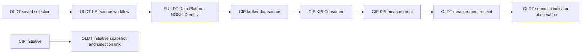

# EU LDT City Innovation Planner Integration

## Purpose

This integration makes City Innovation Planner (CIP) an optional planning add-on for OLDT. OLDT remains the city data, analytical query, geometry, and provenance system. CIP manages KPIs and initiatives. EU LDT Data Platform is the NGSI-LD exchange boundary used by the CIP broker connector.

The integration supports both directions:

1. OLDT publishes a governed metric source to Data Platform and binds it to a CIP KPI.
2. CIP calculates the KPI with its real KPI Consumer.
3. OLDT synchronizes the resulting measurement as external evidence.
4. OLDT synchronizes CIP initiatives and links them to saved OLDT selections.

Removing or disabling the CIP profile does not change OLDT standalone startup, canonical city data, queries, viewers, or standards endpoints.

## Runtime Architecture



Local endpoints:

- OLDT: `http://localhost:4292`
- Data Platform API: `http://localhost:8080/api/v1`
- CIP UI: `http://localhost:4350`
- CIP API: `http://localhost:4351/api/v1`
- Identity Management: `http://localhost:9080`

The local bundle connects the CIP backend and KPI Consumer to the external Docker network `ldt-shared`. It reuses Data Platform Kafka at `data-broker:9092` and creates two topics:

- `calculate-kpi`
- `calculate-kpi-results`

## OLDT Source Contract

The operator can publish either:

- a metric already stored on a saved OLDT selection, such as `result_count`; or
- an aggregate over a numeric member attribute: `avg`, `sum`, `min`, `max`, or `count`.

The workflow produces one NGSI-LD `KeyPerformanceIndicatorSource` entity. The important contract is:

```json
{
  "id": "urn:ngsi-ld:KeyPerformanceIndicatorSource:guanajuato:<binding-key>",
  "type": "KeyPerformanceIndicatorSource",
  "observedValue": {
    "type": "Property",
    "value": 20174,
    "unitCode": "objects"
  },
  "cityId": { "type": "Property", "value": "guanajuato" },
  "sourceSystem": { "type": "Property", "value": "OLDT" },
  "sourceSelectionId": { "type": "Property", "value": "<selection-uuid>" },
  "sourceQueryHash": { "type": "Property", "value": "<sha256>" },
  "aggregationMethod": { "type": "Property", "value": "value" }
}
```

CIP receives a broker datasource with:

- `connectorType`: `broker`
- `config.entityId`: the NGSI-LD entity ID
- `config.datatype`: `context`
- `resultJsonPath`: `$.observedValue.value`
- `formulaParameter`: `OldtValue`
- default formula: `mean(OldtValue)`

CIP requires KPI and datasource creation as two API operations. OLDT therefore creates the KPI first and then calls `POST /api/v1/datasources` with the generated KPI ID.

## OLDT Persistence

Migration `054_eu_ldt_city_innovation_planner_exchange.sql` adds:

- `ldt_interop.cip_metric_bindings`: OLDT selection, Data Platform entity, CIP KPI, datasource, metric definition, and provenance.
- `ldt_interop.cip_measurement_receipts`: idempotent CIP measurement receipts linked to a binding when possible.
- `ldt_interop.cip_initiative_links`: CIP initiative snapshot plus an optional OLDT saved-selection link.

Remote records are not copied into OLDT canonical physical-city tables
automatically. They remain explicitly external planning evidence. A successful
measurement with an indicator-aware binding is also materialized in
`ldt_science.indicator_observations` at city grain with `validation_status=lab`
and `authority_status=integration-lab`; it never becomes an official value by
receipt alone.

## Workflows

### `eu-ldt-cip-publish-metric-source`

Required input:

- `cipProfileKey`
- `dataPlatformProfileKey`

Use either `selectionSetId` or an explicit numeric `value`. Optional fields include `metricKey`, `attributeKey`, `aggregation`, `unit`, `cipKpiId`, `kpiName`, `ngsiProperty`, and `requestCalculation`.

The workflow resolves the OLDT metric, publishes and reads back NGSI-LD, creates or reuses a CIP KPI, creates the datasource, optionally requests calculation, and stores the binding.

### `eu-ldt-cip-sync-measurements`

Required input: `cipProfileKey`.

By default, only measurements for KPIs already bound in OLDT are imported.
`kpiIds` can narrow the synchronization; `includeUnbound` is an explicit
opt-in. Bindings that carry `indicatorKey`, `indicatorExternalCode`, and
`indicatorCatalogKey` produce an idempotent semantic indicator observation in
addition to the technical receipt.

### `eu-ldt-cip-sync-initiatives`

Required input: `cipProfileKey`.

`initiativeIds` narrows the remote read. `links` accepts records shaped as:

```json
{
  "initiativeId": "<cip-initiative-uuid>",
  "selectionSetId": "<oldt-selection-uuid>"
}
```

## Admin API

- `GET /api/admin/eu-ldt/cip/state`
- `POST /api/admin/eu-ldt/cip/initiative-links`
- `POST /api/admin/workflows/eu-ldt-cip-publish-metric-source/runs`
- `POST /api/admin/workflows/eu-ldt-cip-sync-measurements/runs`
- `POST /api/admin/workflows/eu-ldt-cip-sync-initiatives/runs`

The normal workflow approval and execution endpoints remain authoritative for run decisions and trace evidence.

## Operator UI

Open `http://localhost:4292/operations/eu-ldt` and use the **City Innovation Planner** section.

1. Select or create a CIP profile and set its API/browser URLs and authentication mode.
2. Select the Data Platform profile.
3. Enter a saved selection ID, or use an existing CIP KPI ID when rebinding.
4. Choose the selection metric or member attribute, aggregation, unit, and NGSI-LD property.
5. Use **Publish Metric Source**.
6. Use **Sync Measurements** and **Sync Initiatives** as needed.
7. Link a synchronized initiative to a saved OLDT selection with **Link Initiative**.

The same panel shows binding, measurement, initiative, and spatial-link counts plus current KPI and initiative records.

## Authentication

OLDT profiles support `none`, bearer token, and OAuth2 client credentials. Profiles are instance-specific, so another national, municipal, cloud, or local CIP deployment can be added without code changes.

The KPI Consumer Scorpio connector supports:

- `SCORPIO_AUTH_MODE=none` for an anonymous Data Platform endpoint.
- `SCORPIO_AUTH_MODE=password` for the existing password-grant behavior.

## Verified End-to-End Evidence

Validated on 2026-07-11 against the local Guanajuato runtime:

- Saved OLDT selection: `9f839bcc-90fc-4ad3-b4e7-5e44d6decb49`
- Published value: `20174 objects`
- Data Platform entity: `urn:ngsi-ld:KeyPerformanceIndicatorSource:guanajuato:cip-smoke-1783759116434`
- CIP KPI: `c19ca428-cb99-4c91-96cd-877f0be18929`
- CIP datasource: `e73c53e7-5209-4aeb-9f01-1d1dd68f81d9`
- Consumer-generated measurement: `e4b49a12-72da-4953-af75-ba65f49cf059`, status `success`, measure `20174`
- CIP initiative: `8d76bf76-9243-486a-a358-e16250821fee`
- All three OLDT workflows finished with status `succeeded`.

Run the repeatable integration test with:

```bash
npm run test:eu-ldt-city-innovation-planner-exchange-smoke
```

This test requests the real CIP calculation and waits for the KPI Consumer result. It does not inject a synthetic measurement.

### Full U4SSC acceptance

On 2026-07-12 the same workflow contract was executed for all 91 U4SSC catalog
entries:

- 91 stable NGSI-LD KPI source entities were published and read back;
- 91 CIP KPIs had `u4sscStandard=true` and distinct exact
  `kpiU4SSCCode` values;
- 91 real KPI Consumer calculations were verified; and
- 91 distinct indicator keys returned to OLDT through receipts and semantic
  `lab` observations.

CIP's default global API rate limit is 100 requests per minute. OLDT bulk
acceptance uses a 750 ms request interval plus bounded retries for 429 and
transient 5xx responses. See
`docs/U4SSC_INDICATOR_QUERY_ACCEPTANCE.md` for the complete matrix and
reproduction commands.

## Repaired Upstream Defects

The local bundle applies `patches/city-innovation-planner-local.patch` because the evaluated CIP revision has two blocking defects:

1. KPI measurement creation stores `success|failed|pending`, but its response serializer incorrectly expects the general `DRAFT|SAVED|COMPLETED|...` enum and returns HTTP 500 after writing.
2. The Scorpio Consumer always sends an `Authorization` header, even for anonymous Data Platform deployments. An otherwise valid endpoint then rejects the token.

The patch aligns the measurement response schema with `KpiMeasurementStatusEnum`, broadens the shared response transform type, and adds explicit Scorpio authentication mode. It also avoids slow recursive ownership changes in both Docker build stages.

The CIP health endpoint can still report `Unhealthy` when optional external dependencies are absent even while documentation, KPI, initiative, and measurement APIs are operational. OLDT records that profile state as a warning rather than treating a healthy API contract as unavailable.
