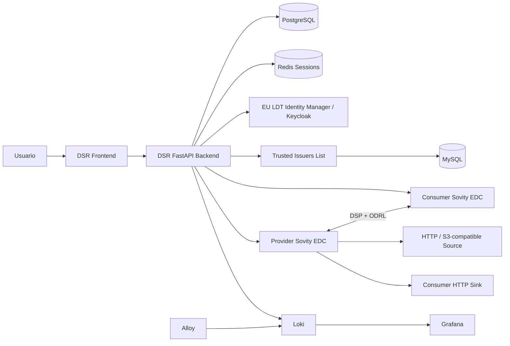
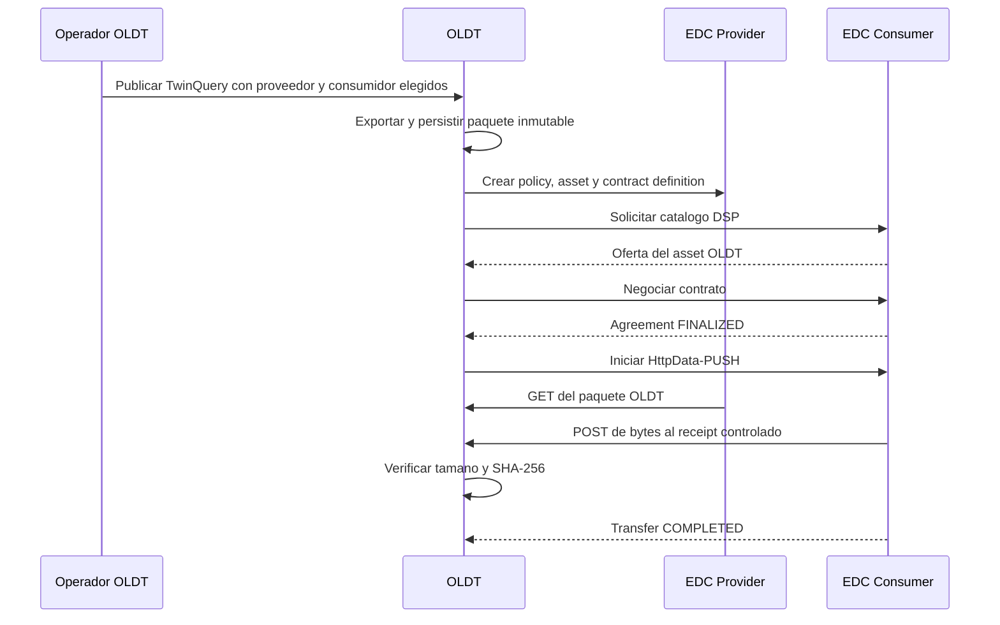

# EU LDT Data Space Ready - laboratorio local

Fecha de validacion: 2026-07-10

## Estado

Data Space Ready fue seleccionada como la siguiente herramienta de EU LDT Toolbox y quedo instalada con un ciclo de intercambio real entre dos participantes EDC. OLDT ya ejecuta ese ciclo desde una TwinQuery y verifica los bytes recibidos.

Estado comprobado:

- frontend y backend de Data Space Ready operativos;
- autenticacion OIDC contra el Identity Manager local de EU LDT;
- multitenencia activa mediante el claim `tenant`;
- participante proveedor y participante consumidor Sovity EDC registrados y saludables;
- Trusted Issuers List activa;
- seis activos publicados por el proveedor;
- seis negociaciones de contrato finalizadas;
- transferencia de los seis activos completada hacia el consumidor;
- perfiles OLDT configurables para cualquier participante proveedor y consumidor EDC;
- publicacion de una TwinQuery real de OLDT como activo HTTP gobernado;
- descubrimiento DSP, negociacion, acuerdo y transferencia `HttpData-PUSH` iniciados por OLDT;
- recepcion en un endpoint controlado por OLDT con SHA-256 y tamano verificados;
- auditoria y observabilidad con Loki, Alloy y Grafana.

Esto valida la herramienta, su flujo EDC y el adaptador opcional de OLDT. Data Space Ready no se convierte en dependencia de arranque: si no hay perfiles EDC, solo queda deshabilitado el workflow de intercambio.

## Fuente evaluada

- Repositorio oficial: <https://code.europa.eu/ldt-toolbox/eu_ldt_data_space_ready>
- Checkout local: `<eu-ldt-lab>/eu_ldt_data_space_ready`
- Commit probado: `07447d068479af82a6b7327d07b002991622f3ab`
- Fecha del commit: `2026-06-23T11:47:29Z`
- Licencia: EUPL-1.2

## Por que se eligio ahora

Se reevaluaron las tres candidatas inmediatas:

| Herramienta | Decision | Razon |
| --- | --- | --- |
| Data Space Ready | Instalar ahora | Cubre intercambio gobernado entre proveedor y consumidor, identidad descentralizada, politicas ODRL, contratos y trazabilidad. Era una capacidad diferente a Data Platform, Play & Visualise y Marketplace. |
| Use Cases & Scenarios | Siguiente candidata | Tiene instalacion local frontend/backend/PostgreSQL y servira para evaluar experimentos y escenarios sobre las herramientas ya instaladas. |
| AI Notebook | Posponer el despliegue completo | Su instalacion oficial pide como minimo 16 vCPU, 32 GB RAM y 50 GB libres, ademas de Kubernetes/Kubeflow. Se evaluara, pero no era el siguiente paso mas eficiente. |

## Que hace la herramienta

Data Space Ready no es otra base de datos municipal. Es el plano de control para que dos organizaciones intercambien activos bajo identidad, contrato y politica.

Desde la perspectiva de un usuario:

1. Entra mediante el proveedor de identidad configurado.
2. Selecciona el participante o scope con el que va a operar.
3. Registra activos y las direcciones tecnicas donde viven los datos.
4. Define politicas de acceso y condiciones ODRL.
5. Publica u obtiene ofertas del catalogo EDC mediante DSP.
6. Negocia y acepta contratos entre proveedor y consumidor.
7. Ejecuta transferencias de datos.
8. Consulta DIDs, organizaciones, solicitudes, contratos y auditoria.

El menu validado incluye `Dashboard`, `Administration`, `My Assets`, `Contracts`, `DID & Orgs`, `Catalog`, `Audit` y `Data Space Management`.

## Arquitectura instalada



Flujo OLDT validado:



Componentes del laboratorio:

- React frontend servido por Nginx;
- backend FastAPI;
- PostgreSQL para el registro DSR;
- Redis para sesiones;
- dos Sovity EDC Community Edition 16.3.0;
- PostgreSQL separado para cada EDC;
- MinIO y servicios HTTP de origen/destino;
- FIWARE Trusted Issuers List con MySQL;
- Loki, Alloy y Grafana.

La instalacion completa usa 16 contenedores. En la medicion posterior a la prueba consumia aproximadamente 2.32 GiB de RAM en reposo. La suma de tamanos virtuales de las 14 imagenes unicas fue aproximadamente 1.32 GB; los volumenes y logs se agregan aparte.

## Direcciones locales

| Servicio | URL |
| --- | --- |
| Data Space Ready UI | <http://data-space-ready.127.0.0.1.nip.io:4330> |
| Backend / OpenAPI | <http://localhost:4331/docs> |
| Backend health | <http://localhost:4331/health> |
| Grafana | <http://localhost:4332> |
| Trusted Issuers List | <http://localhost:8079> |
| Trusted Issuers health | <http://localhost:8079/health> |
| Sovity consumer management | <http://localhost:8181> |
| Sovity provider management | <http://localhost:8182> |
| MinIO console | <http://localhost:9001> |

Puertos movidos para convivir con las otras herramientas EU LDT:

- frontend DSR: `4330`;
- backend DSR: `4331`;
- Grafana: `4332`;
- PostgreSQL DSR: `5443`;
- Redis DSR: `6383`;
- Alloy: `9081`, porque `9080` pertenece al Identity Manager local.

## Identidad y multitenencia

La aplicacion usa el cliente OIDC `tool7` del realm `LDT`; no esta acoplada a credenciales locales propias.

Se creo un usuario tecnico de laboratorio con estos roles de cliente:

- `dsr:operator`;
- `dsr:asset-owner`;
- `dsr:catalog-reader`.

No se le asigno `dsr:compliance-officer`, porque el codigo de DSR hace de ese rol un perfil estrictamente de solo lectura incluso si el mismo usuario tambien es operador.

Tambien se configuro:

- atributo de usuario `tenant=*`;
- protocol mapper OIDC `tenant`;
- claim `tenant` incluido en access token, ID token y UserInfo.

Scripts idempotentes del laboratorio:

```text
<eu-ldt-lab>/eu_ldt_data_space_ready/deployments/dev/configure_keycloak_operator.py
<eu-ldt-lab>/eu_ldt_data_space_ready/deployments/dev/validate_oidc_roles.py
```

## Comandos de operacion

Despliegue completo usado:

```bash
cd <eu-ldt-lab>/eu_ldt_data_space_ready
USE_SOVITY_EDC=1 HEADLESS=1 WITH_TRUST_ANCHOR=true make deploy
```

Provisionamiento y validacion del operador:

```bash
cd <eu-ldt-lab>/eu_ldt_data_space_ready/deployments/dev
venv/bin/python configure_keycloak_operator.py
venv/bin/python validate_oidc_roles.py
```

Registro idempotente de los dos conectores en DSR:

```bash
cd <eu-ldt-lab>/eu_ldt_data_space_ready/deployments/dev
set -a
source backend.env
set +a
USE_SOVITY_EDC=1 venv/bin/python populate_db.py int
```

Prueba automatizada completa:

```bash
cd <eu-ldt-lab>/eu_ldt_data_space_ready/deployments/dev
venv/bin/python smoke_test_dsr_lab.py
```

El archivo `backend.env` contiene secretos locales y no debe publicarse.

## Evidencia de la prueba

La prueba automatizada termino con todos los checks en `true`:

| Check | Resultado |
| --- | --- |
| Backend health/readiness | OK |
| Trusted Issuers List | `UP` |
| Rol OIDC de operador | OK |
| Claim multitenant `tenant=*` | OK |
| Conectores DSR registrados | 2 |
| Estado de ambos conectores | `healthy` |
| Activos del proveedor | 6 |
| Negociaciones finalizadas | 6 de 6 `FINALIZED` |
| Ultima transferencia por activo | 6 de 6 `COMPLETED` |

Activos transferidos:

1. `weather-asturias-forecast`
2. `weather-asturias-stations`
3. `air-quality-asturias-historical`
4. `air-quality-asturias-stations`
5. `power-demand-asturias-historical`
6. `power-demand-asturias-realtime`

Hubo un intento inicial terminado para `air-quality-asturias-historical` por un error transitorio de escritura al sink. Se repitio usando el mismo contrato y termino `COMPLETED`. Por eso el UI conserva siete intentos historicos, aunque la transferencia mas reciente de cada uno de los seis activos esta completada. El sink contiene seis recepciones exitosas.

### Evidencia OLDT -> EDC -> OLDT

Se ejecutaron dos niveles de prueba el 2026-07-10:

1. smoke de integracion invocado dentro del contenedor OLDT;
2. publicacion real iniciada desde el boton `Exchange query through data space` del Analytical Map.

La corrida de UI produjo:

| Evidencia | Valor |
| --- | --- |
| Workflow run | `97b00187-d6e9-4bf2-bde1-a09b39678d2a` |
| OLDT package | `d950b019-abbd-4bfe-9793-382c24d2d7ca` |
| EDC asset | `oldt-guanajuato-4b8820abe9c477b1` |
| Contract agreement | `019f4d26-6a54-708b-94f3-b89798134db0` |
| Transfer process | `019f4d26-7169-769d-b8a1-66a2d72e4147` |
| OLDT receipt | `2d51bcf1-7213-4934-a291-6573ef96e9ff` |
| Objetos exportados | 10 |
| Bytes enviados/recibidos | 30,295 / 30,295 |
| SHA-256 | `4b8820abe9c477b19ecf071181c2a4418722e0dbaf5102e065abe64413a07d45` |
| Negociacion | `FINALIZED` |
| Transferencia | `COMPLETED` |
| Receipt OLDT | `verified` |

El smoke automatizado mas reciente produjo el workflow `dbbb6830-6b59-449e-930a-b035c41ecceb`, transfirio 25 carreteras y verifico 83,296 bytes en el receipt `86f8cc8b-dbb9-4d0d-a11b-46a9476b1955`. Tambien intento ejecutar el workflow con un perfil proveedor inexistente: ese run fallo como estaba previsto y OLDT siguio operativo con 157,535 entidades canonicas.

Comando reproducible:

```bash
docker exec 31-twin-base-studio-guanajuato-web-test \
  npm run test:eu-ldt-data-space-ready-exchange-smoke -- --city=guanajuato
```

### Escenario operativo: OLDT publica y Data Space Ready consume

El round trip anterior se conserva como smoke tecnico, pero ya no representa la operacion normal del producto. El flujo operativo probado separa los roles:

1. OLDT publica el paquete y la oferta mediante el workflow `eu-ldt-data-space-publish`.
2. OLDT termina en `edc-published`; no elige consumidor, no negocia y no inicia transferencias.
3. Un usuario consumidor entra a Data Space Ready, descubre el proveedor por DSP, revisa la politica, negocia el contrato y elige su destino.
4. Data Space Ready conserva el acuerdo y los procesos de transferencia del lado consumidor.

Evidencia del 2026-07-10:

| Evidencia | Valor |
| --- | --- |
| Workflow OLDT de publicacion | `739a69db-7b73-4a74-bbad-9428ff3f8b46` |
| OLDT package | `0b0551a9-4664-408c-9f5b-2cfbdff49300` |
| EDC asset | `oldt-guanajuato-d2fd29ad1adb8e49-739a69db` |
| Provider participant | `provider-connector` |
| Provider DSP | `http://provider-connector:9084/api/dsp` |
| Estado OLDT despues de publicar | `published`, cero receipts |
| Agreement creado por consumidor | `019f4d88-9958-7c83-b4f6-72676f00ba32` |
| HTTP transfer al sink | `019f4d92-0308-7aff-b2e6-39083fb3878c`, `COMPLETED` |
| S3 transfer persistente | `019f4d99-121f-700f-b12e-17c2e5f16919`, `COMPLETED` |
| Destino persistente | `consumer-data/oldt/guanajuato/oldt-guanajuato-d2fd29ad1adb8e49-739a69db.geojson` |
| Contenido recibido | GeoJSON `FeatureCollection`, 12 `LineString` |
| Bytes publicados/recibidos | `41,348 / 41,348` |
| SHA-256 publicado/recibido | `d2fd29ad1adb8e4947b42676ac8c7e604b2c11752882d8e3d0a747f847a581e9` |

El sink HTTP oficial registro el `POST` y el `Content-Type`, pero su parser muestra `{}` para `application/geo+json`. Por eso la evidencia de contenido se cerro con `AmazonS3-PUSH` hacia el MinIO consumidor: el objeto persistido se volvio a leer y su tamano y SHA-256 coincidieron exactamente con OLDT.

Smoke reproducible de publicacion sin consumidor:

```bash
docker exec 31-twin-base-studio-guanajuato-web-test \
  npm run test:eu-ldt-data-space-ready-publish-smoke -- --city=guanajuato
```

## Defectos encontrados en el bootstrap oficial

Se corrigieron localmente estos problemas del checkout probado:

1. `OIDC_SCOPES` sin comillas rompia `source backend.env`.
2. El directorio de logs quedaba con propietario incompatible con el UID del backend.
3. El populator asumía IDs numericos, mientras el backend actual devuelve UUID.
4. Los mensajes de error ocultaban respuestas HTTP 4xx por usar la verdad booleana de `requests.Response`.
5. El populator intentaba crear catalogos TMF620 para conectores `edc`, aunque el backend solo permite esa administracion para `ngsi-ld` y `custom`.

La correccion local no desactivo autenticacion, autorizacion, multitenencia ni politicas.

## Por que el panel muestra cero catalogos locales

No es una falla del ciclo EDC. En esta version, el facade local de catalogos de DSR administra TMF620 para conectores `ngsi-ld` y `custom`. Los conectores Sovity `edc` intercambian catalogo, ofertas y contratos mediante DSP. El panel comprueba los seis contratos y los activos EDC aunque la tarjeta `Catalogues by Status` permanezca en cero.

## Operacion desde OLDT

Configuracion de participantes:

1. Abrir <http://localhost:4292/operations/eu-ldt>.
2. En `Data-space participants`, registrar por separado un perfil `provider` y uno `consumer`.
3. Configurar Management API, API key, participant ID, DSP del proveedor y URL de callback alcanzable hacia OLDT.
4. Usar `Test` en la tabla de perfiles. Un perfil funcional devuelve `3/3 checks passed`.

Publicacion de una consulta:

1. Abrir <http://localhost:4292/analytical-map> o <http://localhost:4292/city-3d>.
2. Preparar la TwinQuery.
3. Pulsar el icono de publicacion junto a Download.
4. Elegir proveedor, formato, limite y licencia. No se elige consumidor.
5. Pulsar `Publish offer`.
6. El UI muestra `Published`, el asset ID y `Open consumer catalog`. Esto no afirma que exista contrato o transferencia.

Consumo desde Data Space Ready:

1. Abrir el enlace `Open consumer catalog`, o entrar a `Catalog` y filtrar con el provider DSP y participant ID reportados por OLDT.
2. Abrir el asset y revisar `Policy Details`.
3. Pulsar `Negotiate`; el acuerdo aparece en `Contracts > Active Contracts`.
4. En el menu del acuerdo elegir `Initiate Transfer`.
5. Elegir `HttpData-PUSH` para un receptor HTTP o `AmazonS3-PUSH` para almacenamiento persistente.
6. Verificar `Contracts > Transfers`; el proceso debe llegar a `Completed`.
7. En un destino persistente, verificar bytes, estructura y SHA-256 del objeto recibido.

La afirmacion validada es: **OLDT puede operar standalone o publicar TwinQuery packages mediante un proveedor EDC configurable; un consumidor independiente de EU LDT Data Space Ready puede descubrir la oferta, negociar el contrato y transferir el contenido a su propio destino con integridad verificable.**
